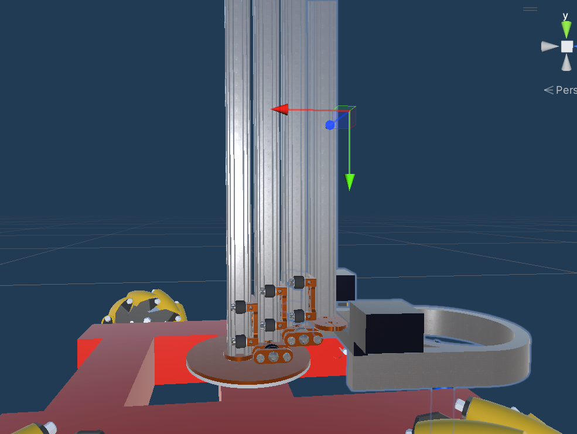
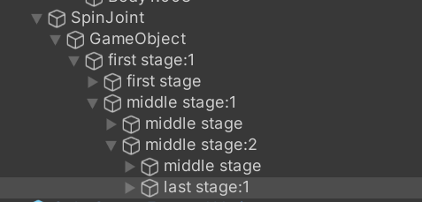
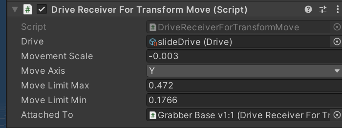
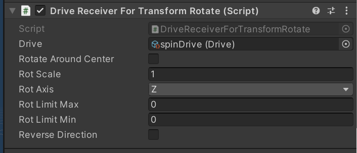

# Manual Creation

This is for manually creating a new bot for the power play app. Repo: https://github.com/VRS-Power-Play/VRSConstructorKit-PP .

## Overview

This app uses the UPM-RobotConstructionKit. Bots are made using prefab variants.

Rough Structure:

Bot-Frame (Contains wheels and basic drivetrain)
|
----Small-BotFram(wheels are moved for a smaller frame)
    |
    ----Tiny Bot(contains the actual bot body & sliding motors.)
    
Since Bot-Frame is the parent, any changes to bot-frame will be made to all bots.

Each custom bot is going to be addressable, so it will be stored on the web server and loaded on request after the initial game is loaded. 
This is done by clicking 'custom bot' and entering the name of the robot(addressable name).

### Drives

Drives are scriptable objects that control movement. The inputmanager/encodermanager sets values for these and they are then read by drive receivers.
They are located in Assets/Resources/Props/Drives

Used ones are:
- TempRobotXX(FL,FR,RL,RR) (WASD)- all the drives to control each wheel individually.
- slideDrive (R/F)- For SlidingArms. Basically used for any 'Main Action' of the powerplay bot. the SwingingArm bot uses SlideDrive to raise and lower its grabber as well.
- grabDrive (C/V)- To grab and release cones.
- spinDrive(optional)(T/G) - an extra motor to spin a robot arm around.

### Components
DrivetrainMovement: **DriveReceiverSpinningWheels** 
Sliding: **DriveReceiverTransformMove** - this moves an object up or down, with a limitation on movement.  
Rotation: **DriveReceiverTransformRotate** - this rotates an object with a limitation.(used on SwingingArmTall) 
Rotation: LockGlobalRotation - this restricts an object to a specifical rotation. useful if you need joints to follow along with a movement but not rotate. 
Rotation: LockRelativePosition - this lock an object to a specific distance from another. used to keep bot parts following with their parent but not moving out of place. 

## Rough Process

1. You get a model
2. Import model into unity project.
3. duplicate a robot in Prefabs/DefaultBots.
4. start editing and remove the old robot parts. Dont remove WheelColliders/WheelModels or anything else blue as that is part of the frame.
5. add in the new model and match it with the wheels.
6. set up slide drives/rotation.
7. set up grabber. You might be able to use the default grabber in Prefabs/DefaultBots/Parts.
8. test bot. You can do this by going into PowerPlayNewBots scene, GUI\IntroCanvas\ChooseBot and changing one of the SpawnPrefabs in the ChooseBot component.
9. mark prefab as addressable and give it a simple name.
10. Goto Window\AssetManagement\Addressables\Groups and give your new robot the 'robot' label.
11. In that same window, Build->New Build->Default Build Script. this will create files in your RepoFolder: /ServerFiles/WebGL is what you want.
12. Send the contents of the folder to jon.

## More Details

### 6. Set up Slide Drives Rotation

#### DriveReceiverTransformMove

To setup a sliding motor, youll want to make sure you set up the parents first. Moving the first slide (lefthand side) is going to move all the rest of the slides, so we need to make sure they are nested like so:

After that, you want to add DriveReceiverTransformMove to each of the slide objects. In this instance they are added to:
first stage:1, middle stage:1, last stage:1.

Now to configure each slide. 
Properties:
- Drive: This is the drive scriptable object used to control this contraption. usually just assign it to slideDrive.
- MovementScale: the speed of movement. You can set to negative values to reverse movement.
- MoveAxis: which axis to move on.
- MoveLimitMax: maximum position of the object along the axis. LocalPosition.
- MoveLimitMin: minimum position of object.
- AttachedTo: Child object that has a TransformMove component. This object will only move if the AttachedTo object has reached ITS min or max limit.

Move your object and get the min&max value that you want to set for the extent of its movement. You get this from the transform property on the top of the object.
if it has a child object with TransformMove make sure to set it in the AttachedTo property.

#### DriveReceiverTransformRotate

Properties:
- Drive: This is the drive scriptable object used to control this contraption. usually just assign it to slideDrive.
- RotateAroundCenter: rotate around models center.
- RotScale - speed of movement.
- RotLimit Max/Min: Same as move limit.

There is a possible issue here you may run into where a models origin isnt where it should be - so parts dont rotate as they should. This might need to be resolved by modeller or you if you are familiar with blender. If its only somewhat off you can try making a child object that is offset slightly for proper rotation.

